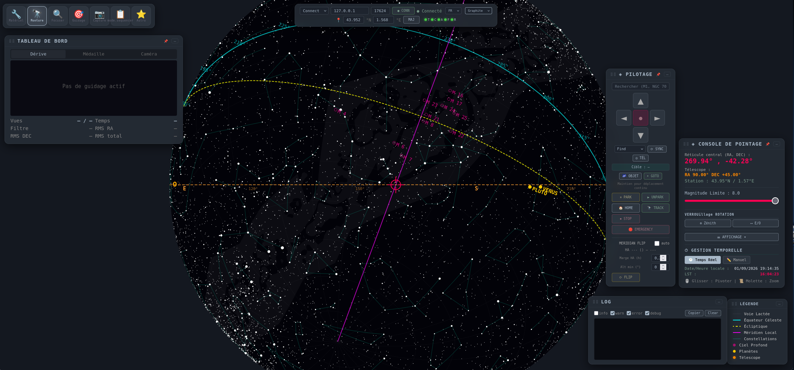
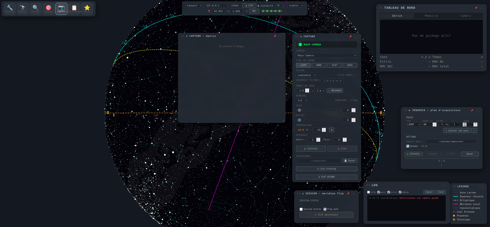
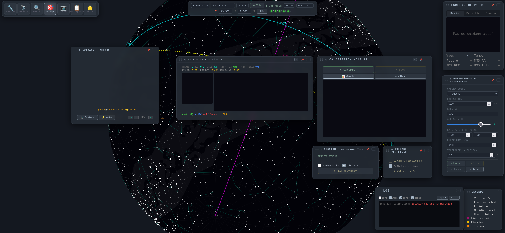
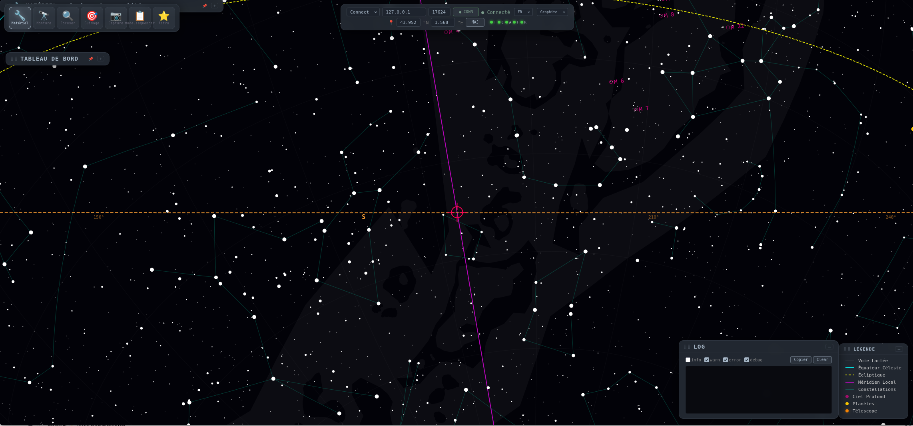
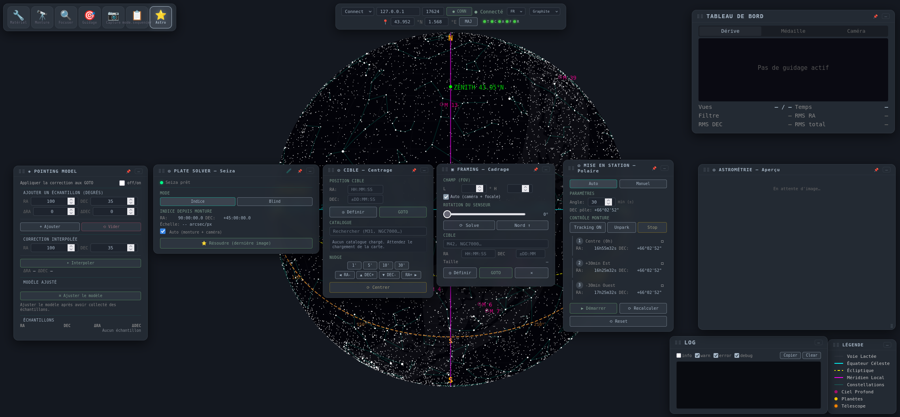

# Noctua

Interface web (FastAPI + Vanilla JS) pour le contrôle d'équipements astronomiques via un serveur [INDIGO](https://www.indigo-astronomy.org/).

 

Piloter monture, caméras, focuser et roue à filtres depuis le navigateur : autoguidage en étoile, autofocus HFR, calibration, séquences d'acquisition et mise au point polaire assistée.

## Captures d'écran

| Mode Monture | Mode Capture | Mode Autoguidage |
|:---:|:---:|:---:|
|  |  |  |

| Sky Map | Dashboard | Mise en station polaire |
|:---:|:---:|:---:|
|  |  |  |

> Pour prendre les screenshots : lancez le serveur avec le mock (`./start-mock-server.sh`), ouvrez l'interface, naviguez dans chaque onglet, et faites un screenshot du navigateur (Ctrl+Shift+S dans Firefox, ou F12 → screenshot node).

## Fonctionnalités

- **Périphériques INDIGO** via client XML/INDI natif (mount, CCD, guide CCD, focuser, roue à filtres, dôme), auto-reconnect
- **Panneau capteur / profils** : détection des appareils, profils persistants (YAML « profils »)
- **Autoguidage** : boucle de guidage orchestrée côté front (mesure centroïde), calibration, dérive RA/DEC en temps réel, RMS/SNR, crosshair, bips de tolérance
- **Autofocus** : scan V-courbe, **HFR** (half-flux radius) par mesure du FWHM gaussien, adaptation
- **Séquence d'acquisition** : plan éditable (type/durée/filtre/×/pause), pause/reprendre/stop/reset, dithering
- **Capture** : exposition, réduction **BZERO/BSCALE**, sauvegarde des FITS nommés `capture_{filtre}_{timestamp}.fits`
- **Sky map fluide** : orthographique canvas, projection des étoiles accélérée (vecteurs unitaires), catalogue **41 411 étoiles** (mag ≤ 8), recherche d'objets (NGC/IC/Sharpless + noms multilingues)
- **Temps de pose idéal** : pose(s) test (bouton « Mesurer le ciel », 1 ou 3 prises) → mesure du fond de ciel en ADU/s, extrapolation vers un fond cible, fit linéaire bias-indépendant (3 prises) avec détection de saturation, garde anti-saturation des étoiles, SNR projeté
- **Mise en station polaire** : calcul LST + assistant 3 étapes
- **Orientation** : bascule au méridien (flip) gérée par la monture

## Stack

- **Backend** : Python 3.10+, FastAPI, uvicorn, PyYAML
- **Frontend** : JS vanilla (scripts classiques, pas de build step), Canvas, CSS glassmorphisme
- **Protocole** : INDIGO/INDI XML via TCP (le client parlé INDI au serveur ; le navigateur rejoint le serveur web via WebSocket pour l'état temps réel)

## Compatibilité matérielle — INDIGO comme passerelle universelle

Noctua communique avec **un seul protocole** : INDIGO/INDI (TCP XML sur le port 7624). Ce choix est architectural et délibéré.

### Comment ça fonctionne

```
┌──────────────┐     TCP/INDIGO      ┌─────────────────┐
│   Noctua     │ ◄──────────────────► │  indigo_server   │
│  (navigateur)│                      │  (port 7624)     │
└──────────────┘                      └────────┬─────────┘
                                               │
                              ┌─────────────────┼─────────────────┐
                              │                 │                 │
                     ┌────────▼──────┐ ┌────────▼──────┐ ┌───────▼───────┐
                     │ Drivers natifs│ │ Drivers ASCOM │ │ Drivers INDI  │
                     │   INDIGO      │ │  (Windows)    │ │  (legacy)     │
                     └───────────────┘ └───────────────┘ └───────────────┘
```

**INDIGO est le middleware unique** qui abstraît la couche matérielle. Noctua n'a pas besoin de savoir si un driver est natif INDIGO, ASCOM ou INDI — il parle toujours le même langage.

### Écosystème supporté

| Plateforme | Driver utilisé | Fonctionne avec Noctua ? |
|---|---|---|
| **INDIGO natif** (Linux, macOS, Windows) | Drivers CCD/ mount/ focuser INDIGO | **Oui** — natif |
| **INDIGO + ASCOM** (Windows) | `indigo_server` charge les drivers ASCOM | **Oui** — via INDIGO |
| **INDIGO + INDI** (Linux) | `indigo_server` charge les drivers INDI | **Oui** — via INDIGO |
| **ASCOM pur** (Windows, sans INDIGO) | ASCOM COM direct | **Non** — nécessite `indigo_server` |
| **INDI pur** (Linux, sans INDIGO) | indiserver direct | **Non** — nécessite `indigo_server` |

### Pour les utilisateurs ASCOM

Si vous utilisez des drivers ASCOM (ZWO ASI, QHY, etc.) sur Windows :

1. Installez [INDIGO](https://www.indigo-astronomy.org/) — il inclut un serveur INDIGO qui charge automatiquement vos drivers ASCOM existants
2. Lancez `indigo_server` avec vos drivers ASCOM
3. Noctua se connecte au serveur INDIGO et contrôle vos équipements ASCOM normalement

**Rien ne change** — vos drivers ASCOM fonctionnent, Noctua les voit comme des appareils INDIGO.

### Pour les utilisateurs INDI (legacy)

Si vous avez un serveur INDI (`indiserver`) existant :

1. INDIGO est compatible INDI v2 — `indigo_server` peut charger les drivers INDI
2. Migrez progressivement vers les drivers INDIGO natifs (meilleure stabilité)

### Pourquoi ce choix ?

- **Un seul protocole** = un seul client, un seul code, moins de bugs
- **Cross-platform** — INDIGO tourne sur Linux, macOS, Windows. ASCOM COM est Windows-only.
- **Futur-proof** — INDIGO est activement développé et remplace INDI
- **Communauté** — L'écosystème INDIGO grandit et intègre nativement les drivers ASCOM

## Démarrage rapide

```bash
# 1. Installation (venv + dépendances) — ou voir section « Installation »
./install.sh

# 2. Lancement
./start.sh                    # lit config.yaml (INDIGO + web)
./start.sh <host_indigo>:7624 # surcharge l'hôte du serveur INDIGO
./start.sh --port 8080        # surcharge le port web
```

Puis ouvrir **http://<host>:8080** dans le navigateur.

## Prérequis

| Prérequis | Détail |
|---|---|
| **Python 3.10+** | requis par le backend (FastAPI, numpy, seiza) |
| **pip + venv** | fournis par `python3-venv` / `python3-pip` (Debian/Ubuntu) |
| **INDIGO** (`indigo_server`) | un serveur INDIGO accessible sur le réseau (matériel réel ou simulateurs). Noctua parle INDIGO/INDI sur TCP **port 7624** — c'est le seul middleware supporté |
| **(optionnel) `seiza`** | solveur astrométrique. Installé automatiquement en général ; s'il échoue, le serveur fonctionne mais la résolution d'astrométrie est désactivée |

> **Le port INDIGO est toujours `7624` — c'est l'hôte qui dépend de votre réseau.**
> À l'installation, renseignez l'adresse IP du serveur INDIGO (réel ou
> simulateurs) dans `config.yaml` sous `indigo.host`, ou passez-la en argument
> à `./start.sh <indigo_host>:7624`.

Prérequis système (ex. Ubuntu/Debian) :

```bash
sudo apt install python3 python3-venv python3-pip git
```

## Installation

La manière la plus simple est d'utiliser le script dédié (crée `.venv`,
installe les dépendances et copie `config.example.yaml` si besoin) :

```bash
./install.sh
```

Ou manuellement :

```bash
python3 -m venv .venv                 # environnement virtuel unique
source .venv/bin/activate             # (Windows : .venv\Scripts\activate)
python -m pip install --upgrade pip
python -m pip install -r requirements.txt
```

> **Note** : Le projet utilise `.venv` comme environnement unique. Les scripts
> `start.sh` et `start-mock-server.sh` pointent tous deux vers `.venv/bin/python`.
> Si vous avez d'anciennes venvs (`venv`, `venv_new`, `venv_temp`), elles sont
> ignorées — supprimez-les avec `rm -rf venv venv_new venv_temp` pour éviter toute
> confusion.

## Configuration locale & lancement

Créez votre configuration locale à partir du modèle (si `install.sh` ne l'a pas
déjà fait) :

```bash
cp config.example.yaml config.yaml   # puis éditez selon votre réseau
```

`config.yaml` :
- `indigo` : **hôte `host:port` du serveur INDIGO** (port toujours `7624`) et protocole (`connect`)
- `web` : hôte/port d'écoute (défaut `0.0.0.0:8080`)
- `site` : nom du site, coordonnées, fuseau (utilisés pour la distance LST et le flip méridien)
- `telescope` : flip méridien, marge d'angle horaire, altitude min, taux de slew recherche
- `sequence` : répertoire de sauvegarde des FITS, dither `{enabled, amount}`, plan par défaut
  - `exposure` : pose idéale — `target_bg` (fond cible en ADU au-dessus du biais), `shots` (1 ou 3 prises de test), `test_min`/`test_mid`/`test_max` (durées de test), `min_exposure`/`max_exposure` (bornes), `saturation_frac` (seuil de saturation des étoiles)

`profiles.yaml` : stocke les profils de matériel (monture/caméra/caméra guide/focuser/roue). Chemin surchargeable par `INDIGO_PROFILES_PATH`.

> **Attention** : par défaut l'interface se bind sur `0.0.0.0`. **Ne pas exposer
> sur Internet** — réservez à un LAN local ou derrière authentification (état :
> authentification encore absente).

## Test sans matériel (mock)

Pour tester toute l'interface **sans serveur INDIGO réel**, lancez un serveur
INDIGO simulé, puis Noctua dans un second terminal :

```bash
# Terminal 1 : serveur INDIGO mock (port 17624)
./start-mock-server.sh

# Terminal 2 : Noctua branché sur le mock
./start.sh 127.0.0.1:17624
```

## Test à blanc

Un test bout-en-bout automatisé contre le vrai serveur `indigo_server` (drivers simulateurs) :

```bash
python tests/test_blanc_indigo.py            # ports par défaut 17660/18110
python tests/test_blanc_indigo.py --port 17660 --web-port 18110
```

Vérifie : connexion + détection, application de profil, monture (unpark/goto/tracking/park), roue (WHEEL_SLOT natif), focuser (noms natifs + relatif), capture→FITS (vérifie BZERO/BSCALE), séquence (pause/resume/stop/reset/dither), guidage (référence + dérive).

Suites unitaires / flux :

```bash
python -m pytest tests/ -q
python tests/test_exposure.py   # temps de pose idéal (fond de ciel, saturation)
python tests/test_guide_flow.py
python tests/test_sequence_flow.py
npx playwright test   # tests UI (voir tests/)
```

## Structure

```
config.yaml          # configuration (INDIGO, web, séquence, flip)
ui.yaml, profiles.yaml # état runtime (positions panneaux, profils) — gitignorés
run.py               # point d'entrée serveur (INDIGO client + web)
indigo/
  client.py          # client TCP XML INDIGO
  registry.py        # découverte + auto-connexion
  devices/           # mount, camera, focuser, filterwheel, guide, autofocus, sequence, live_stack, solver
  profiles.py        # persistance profils YAML
web/
  server.py          # API FastAPI (REST + WS) — câblage
  routers/           # routes REST par domaine (register(app, server))
  static/            # UI (index.html, i18n.{fr,en}.js, ws.js, panneaux *.js, style.css)
tests/               # unit + flow + à-blanc + specs Playwright
docs/screenshots/    # captures d'écran pour le README
PLAN.md, CHECKPOINT.md, TODO_LIST.md, TESTS.md
```

## Licence

[MIT](LICENSE) — cadeau à la communauté des astronomes amateurs.

## Avertissement

- Le contrôle de matériel astronomique réel présente des risques : utilisez à vos risques et périls, toujours en couvrant votre équipement, et testez d'abord avec les simulateurs.
- L'application suppose que le serveur INDIGO et la caméra sont sur le même LAN.