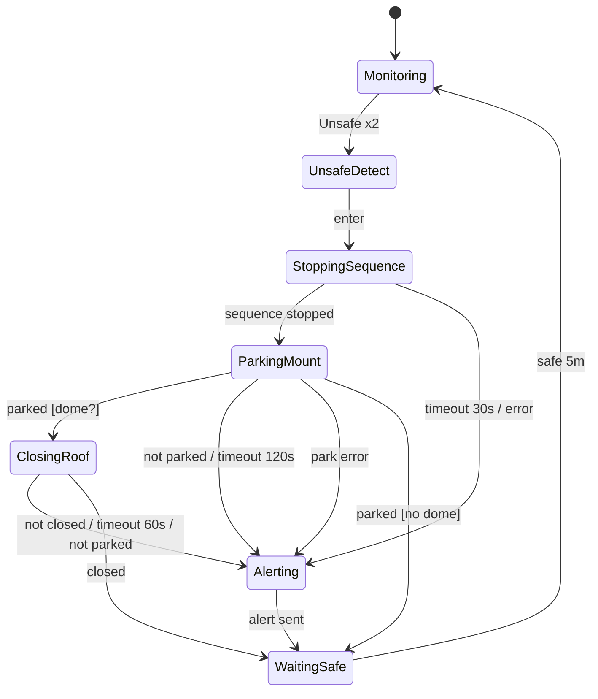

# Noctua — Automate Safety (design P2)

> Plugin `safety` : du minimaliste (allsky seule) au complet (station + dome). Garantit l'ordre **Stop → Park → Close** et l'alerte si un maillon échoue.

---

## 1. Contexte

* **Sources** cumulables : `allsky` (RTSP/HTTP + IA ou seuil), `aux_station` (`aag_cloudwatcher`/`mgbox`/`skyalert` via `indigo_aux_*`), `openweather` optionnel. Chaque source publie `Safe/Unsafe + age`.
* **Consommateurs** : `SequenceRunner`, `Mount`, `Dome` (plugin `dome` optionnel), `TriggerManager` (alerte user).
* **Invariant** : le toit ne se ferme **jamais** si `mount.isParked==false`. Un `park` qui échoue → on reste `Unsafe` et on alerte, on ne force pas `close`.

---

## 2. États

```
Idle → Monitoring → UnsafeDetect → StoppingSequence → ParkingMount → [ClosingRoof] → Alerting → WaitingSafe → Monitoring
                                    └─→ Alerting (si stop/park/close timeout ou erreur)
```

| État | Description | Entrée | Sortie |
|------|-------------|--------|--------|
| `Idle` | Plugin chargé, pas de poll | `start()` | `Monitoring` |
| `Monitoring` | Poll cyclique 30-300s (config), agrège `Safe = AND(sources)` | `safe` reste | `UnsafeDetect` si `Unsafe` sur 2 échantillons consécutifs (debounce) |
| `UnsafeDetect` | Détection confirmée, fige la raison | log `warning` | `StoppingSequence` |
| `StoppingSequence` | `sequence.stop()` + attente `running==false` ≤30s | `sequence.stop()` | `ParkingMount` si `done`, sinon `Alerting` (timeout) |
| `ParkingMount` | `mount.park()` + poll `parking/slewing==false && parked==true` ≤120s, retry 1× à 60s | `mount.park()` | `ClosingRoof` si `parked`, `Alerting` sinon |
| `ClosingRoof` | Uniquement si plugin `dome` présent et `dome.connected` | garde `parked==true` → `dome.close()` + poll `closed==true` ≤60s | `Alerting` |
| `Alerting` | Terminal transitoire : `log.error` + `trigger script` (ntfy/mail/webhook) + WS `safety:unsafe` | — | `WaitingSafe` |
| `WaitingSafe` | Attente retour `Safe` avec hystérésis 5m (évite oscillation nuages) | poll `Safe` 30s | `Monitoring` si `Safe` 5m continus |

Tout état sauf `Idle/Monitoring` est **non réentrant** : un nouvel `Unsafe` est ignoré jusqu'à `WaitingSafe`.

---

## 3. Transitions et gardes



| Déclencheur | Garde | Action | Timeout | Échec → |
|-------------|-------|--------|---------|---------|
| `Unsafe x2` | `safe==false` 2 polls | — | debounce 60s | reste `Monitoring` |
| `StoppingSequence` | `sequence.running==true` | `sequence.stop()` | 30s | `Alerting (stop timeout)` |
| `ParkingMount` | `mount.connected` | `mount.park()` | 120s (retry à 60s) | `Alerting (park failed)` |
| `ClosingRoof` | `mount.parked==true && dome.connected` | `dome.close()` | 60s | `Alerting (close failed)` |
| `WaitingSafe` | `safe==true` continu | — | hystérésis 300s | reste `WaitingSafe` |

---

## 4. Agrégation des sources

```
sourceSafe = (value==Safe && age<3*interval && age<10m)
globalSafe = sourceSafe(allsky) AND sourceSafe(aux_station) AND sourceSafe(openweather) [si activée]
si une source désactivée → ignorée
si une source en erreur/timeout → Unsafe (fail-safe)
```

Poll : `allsky` 300s, `aux_station` 30s, `openweather` 600s (configurable). Le plus fréquent dicte `Monitoring` tick (30s).

---

## 5. Pannes et alertes

* **Park impossible** : log `error` + `script alert` + WS `safety:unsafe {reason: "park timeout", mount_ra/dec}` + reste `Unsafe`, **pas de close**.
* **Close impossible** : idem, monture déjà parkée donc safe mécaniquement, mais alerte + reste `Unsafe` jusqu'à intervention manuelle.
* **Séquence ne s'arrête pas** : `Alerting` quand même, puis `ParkingMount` (on ne laisse pas exposer sous la pluie).
* **Alerte user** : via `TriggerManager` `type: script` existant : `curl ntfy.sh/...`, `sendmail`, `apprise`. Variables `{reason, mount_ra, mount_dec, dome_state, age}` + env `NOCTUA_*`.

---

## 6. Intégration Noctua existant

* `server.registry.get_mount()` / `get_dome()` (plugin dome future, même pattern que `flatpanel`)
* `server.sequence.stop()` / `status()` (déjà `SequenceRunner.stop()` non bloquant, on poll `running`)
* `PluginManager` charge `plugins/safety/backend.py` → `register(server)` installe l'automate + routes `GET /api/safety/status`, `POST /api/safety/test` + `frontend.js` (panneau safety, LEDs, seuils)
* Frontend `sky-engine` / `Hub` : `safety:unsafe` → bandeau rouge + log niveau `error`
* `journal.json` : l'automate écrit `safety.json` (état + transitions) à côté, pour debug post-mortem.

---

## 7. Tests

* **Pur** (`tests/test_safety_automaton.py`) : automate sans INDIGO, mocks `mount.park()` qui timeout/succeed, `dome.close()` absent/présent, vérifie ordre et gardes.
* **Flow** (`tests/test_safety_flow.py`) : TestClient + stub devices, scénario `Unsafe → stop → park → close` et `park fail → no close + alert`.
* **E2E** : `mock_indigo` avec `indigo_aux_aag_cloudwatcher` simulé.

---

## 8. Étapes d'implémentation

1. **Ce doc** (validation)
2. `plugins/safety/` squelette + automate pur + tests
3. Câblage serveur (`PluginManager`) + routes
4. `flatpanel` reste référence, `dome` optionnel ensuite
5. Frontend safety panel + doc `UTILISATION.md` § Safety

---

*À valider : seuils par défaut, timeouts, hystérésis 5m, retry park 1×. Tout est configurable via `config.yaml` `safety:`.*
