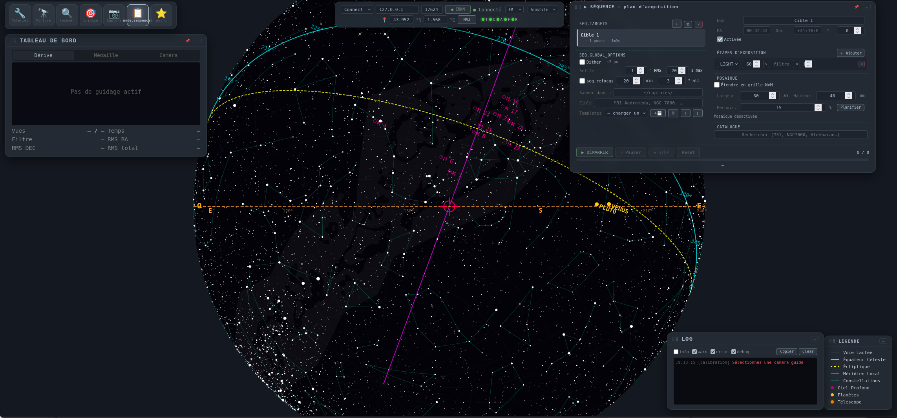

# 6 · Sequencer — full night 📋
{: .fs-6 }

The main planner (NINA-style): **N targets** → each its **plan** → optional **mosaic** → global options (**dithering**, **auto-refocus**) → **templates** → **resume**.

*Sequencer mode: target list on left, plan and mosaic on right, global options (dither, refocus, save_dir) and run bar.*

## Step-by-step

1. **Targets** (left column): `＋ add`, `⧉ duplicate`, `✕ delete`. Each target = `name` (folder), **RA/Dec** (h/°) or `🌌 catalog` (M/NGC…), **rotation** (PA). Order = execution order. Checkbox = enabled.
2. **Plan** (right column): rows `LIGHT/DARK/FLAT/BIAS`, duration, filter, `×`, gain/offset/binning, `delay`. Locked while a session runs.
3. **Mosaic D1**: tick `Expand into N×M grid`, enter `W×H` (arcmin) + `overlap %` → `Plan`. Server computes `R×C = N tiles` from **real FOV** (sensor + focal length). Overlay in **orange on the map** (current tile bold). At run: slew → wait slew done → **solve recenter** (Seiza, if focal) → exposures. FITS keywords `MOSN/MOSROW/MOSCOL`.
4. **Templates C3**: `＋💾` (save named plan), load, delete, `⇪ export` (JSON to clipboard) / `⇓ import`. File `sequence_templates.yaml`.
5. **Global options**: `Dither` (px + settle), `Auto-refocus` (minutes / Δ altitude), `Save to` (`sequence.save_dir`).
6. **Run**: `▶ START` → progress `done/total`, current exposure, `last dither/refocus/save`, error. `⏸ Pause / ▶ resume / ⏹ STOP / ⟲ Reset`. `↻ Resume` relaunches an interrupted session (`journal.json`) — only missing frames are retaken, **continuous indices** `NNN`.

{: .note }
> **Astro deep-dive — mosaic & FOV**
> Step = `FOV·(1−overlap)`, tiles `ceil(span/step)` with RA correction `cos(dec)` (meridians tighten toward pole). Hence focal length matters (see Hardware). Too much overlap = wasted time; too little = gaps.
> → [Mosaic sheet](../astrotech/mosaic.html) · [Masters sheet](../astrotech/masters.html)

## Layout

With named target: `<save_dir>/<target>/<YYYY-MM-DD>/<HHMMSS>/lights/…` (`frame_light_L_001_*.fits`) + `journal.json`. Without target: `capture_YYYYMMDD_HHMMSS/` (legacy). Headers are **normalized C4** (OBJECT, IMAGETYP, FILTER, EXPTIME, CCD-TEMP, GAIN/OFFSET, BINNING, PIXSIZE, FOCALLEN, TELESCOP/SITELAT/SITELONG… — binary rewrite, no astropy).

{: .warning }
> **Pitfalls** — `FOV unavailable` → focal length not set, then **reload the page** (cached). `Plan` shows `0 tiles` → span < FOV or inconsistent focal length.

## 📷 Coming soon

* Photo `sequencer-mosaic-grid.png` — 2×3 grid on M31 with current tile bold
* Photo `sequencer-journal.png` — open `journal.json` and `↻ Resume`

> 🇫🇷 [Version française]({{ site.baseurl }})
