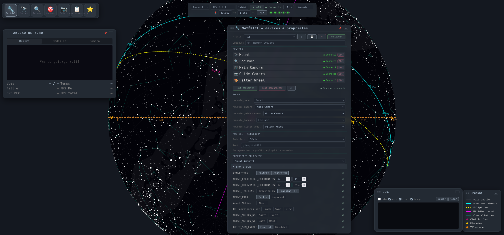

# 1 · Matériel — brancher et se connecter 🔧
{: .fs-6 }

Déclare *qui est quoi* avant de pointer. Un **profil** fige la cartographie rôles → devices INDIGO + la façon dont la monture se connecte (série vs réseau).

*Panneau Matériel : liste des devices détectés, profils persistants, rôles, connexion monture et propriétés INDIGO brutes.*

## Pas-à-pas

1. **Lance le serveur** (`./start.sh` ou `windows\launch-Noctua.bat`) → le bandeau en haut indique `● Hors ligne` puis `● En ligne` quand `indigo_server` répond.
2. Ouvre **🔧 Matériel** → **DEVICES** : coche ceux que tu utilises (ex. `Telescope Simulator`, `CCD Simulator`).
3. **MONTURE — CONNEXION** : choisis `Série` (`/dev/ttyUSB0`, `/dev/ttyACM0`) ou `Réseau host:port` (`192.168.1.10:7624`). Le couple `mount_interface` / `mount_endpoint` est sauvegardé dans le profil.
4. **RÔLES** : assigne `mount`, `camera`, `guide_camera`, `focuser`, `filter_wheel`. Les LEDs du bandeau (`T C A F W`) passent au vert quand le rôle est connecté.
5. **Profil** : `＋` (nouveau), `💾` (sauver), **APPLIQUER** (connecte tout le set). Le profil vit dans `profiles.yaml` (surchargeable `INDIGO_PROFILES_PATH`).
6. **PROPRIÉTÉS DU DEVICE** : sélectionne un device → édition directe des vecteurs INDIGO (`CONNECTION`, `FOCUSER_POSITION`, `CCD_INFO` …) — utile pour saisir la **focale** (obligatoire pour mosaïque / solve).

{: .note }
> **Astro-technique — pourquoi la focale compte**
> Sans focale, Noctua ne peut pas calculer le **champ (FOV)** : `FOV = 2·arctan(capteur / 2·focale)`. Donc : pas de grille mosaïque orange sur la carte, pas de `scale_hint` pour le plate solve, pas de fit-check du framing. Saisis la focale dans les props de la caméra principale puis **recharge la page** (FOV mis en cache).

## Capteurs et roue

* Roue à filtres : `FILTER_SLOT` (`L,R,G,B,Ha`) — la séquence filtre est `L,R,G,B` dans le panneau Capture / Séquenceur.
* LEDs bandeau : gris → `#44cc44` quand connecté, visibles même en thèmes `graphite`/`sobre`.

{: .warning }
> **Piège** — `● Hors ligne` persistant : vérifie `config.yaml` `indigo.host/port` ou lance le mock `tests/mock_indigo.py --port 17624`. En mobile, les champs driver/port série sont masqués mais gérables ici.

## 📷 À venir

* Photo `hardware-profil-apply.png` — clic APPLIQUER + LEDs vertes au bandeau
* Photo `hardware-focale.png` — champ focale dans les props caméra, bandeau lat/lon

Référence config : `profiles.yaml`, `indigo.host/port`, `site.*` — voir [CONFIGURATION](https://github.com/Patrick-81/noctua/blob/master/docs/CONFIGURATION.md) §1/8.

