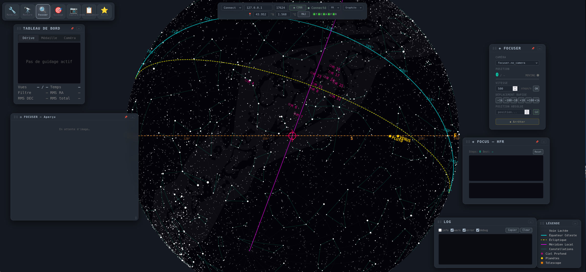

# 3 · Focuser — faire le point 🔍
{: .fs-6 }

Panneaux : **Focuser** (position / vitesse / déplacements) + **Focus — HFR** + **Autofocus V-curve**.

*Mode Focuser : position courante/cible et barre, vitesse, déplacements relatifs/absolus, graphes HFR et V-curve en bas.*

## Pas-à-pas

1. Sélectionne la **caméra** (si plusieurs) en haut du panneau Focuser.
2. Ajuste la **vitesse** (`steps/s`, `OK`) puis bouge par paliers `−1000/−100/−10 / +10/+100/+1k` ou saisis une **position absolue** → `GO`. La barre cyan suit la cible ; `● MOVING` s'allume pendant le déplacement. `⏹ Arrêter` = `FOCUSER_ABORT_MOTION`.
3. **Focus — HFR** : chaque pose alimente le graphe `HFR vs position` (canvas 320×100) + historique (60 px). `Steps` et `Best` s'incrémentent ; `Reset` efface la série.
4. **Autofocus V-curve** : règle `Plage` (steps, ex. 2000) et `Points` (25) → `▶ Lancer`. La V-curve mesure le **HFR** à chaque pas, ajuste une parabole, revient au **Best** et vérifie. Barre `0/25`, `HFR: — / Pos: —` en temps réel.

{: .note }
> **Astro-technique — HFR et V-curve**
> Le **HFR** (half-flux radius) = rayon contenant la moitié du flux d'une étoile : minimum à la mise au point, linéaire de part et d'autre → forme en V. Un bon autofocus exige : étoile non saturée (pic < `saturation_frac` ~60 % du plein-échelle), pose courte (`exposure.target_bg` ~4000 ADU au-dessus du bias), turbulence (seeing) stable. Le scan rate 25 pts / 2000 steps donne ~80 steps/point : compromis temps/précision.
> → [Fiche HFR & V-curve](../astrotech/hfr.md)

## Refocus auto en séquence

En séquenceur : `Refocus auto` se déclenche entre deux poses si `interval_min` (minutes) **ou** `Δ altitude` (°) dépassé — jamais sur la 1ʳᵉ pose (ligne de base). La séquence ne s'arrête pas sur un refocus raté (warning).

{: .warning }
> **Pièges** — HFR qui *monte* au lieu de descendre : focuser inversé (`IN/OUT`), étoile saturée ou double, vent. Vérifie l'aperçu 1:1. Si le focuser ne bouge plus : `ABORT` puis `GO` avec une vitesse plus basse.

## 📷 À venir

* Photo `focuser-vcurve-best.png` — V-curve terminée avec `Best: 12480 / HFR 1.42`
* Photo `focuser-hfr-history.png` — historique HFR sur 30 min de refocus périodique

